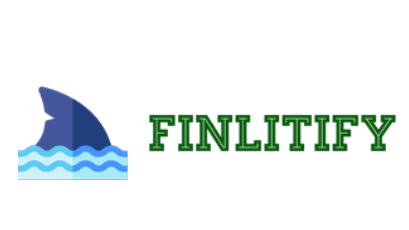

# FinLitify

 
Finlitify is the first step in moving  
## Why did we build it?
According to a study by the Christopher & Dana Reeve Foundation, nearly 1 in 50 people in the U.S live with paralysis, which is approximately 6.6 million people. Additionally, more than 3 million people worldwide have had an arm amputation. With technology continuing to become a more pronounced part of daily life, we wanted to create an easier way for people who have difficulty using a keyboard and mouse to use a computer. 
## How did we build it?
Multiple frameworks, languages, and platforms were utilized to build the application. Python, and specifically, TensorFlow and Keras, were utilized to build the different machine learning models (segmentation and gaze tracking). On the application front, Electron, along with Node.js, were used to build the application. We also implemented numerous APIs in order to provide as many high-quality features as possible, including RobotJS and Electron Virtual Keyboard. We also used React, Bulma, and custom CSS to build the website. Finally, we used GitHub to store and collaborate on our project code.
## Challenges we overcame
One feature that we wanted to add into this project is allowing the user to be able to type with their voice. Unfortunately, we were not able to implement this due to problems with live audio transcription that we did not think would be feasible to solve in the allotted 24 hours. However, as an alternative, we were able to pull up the on screen keyboard when the user is clicking a text-view, which would still be able to allow the user to type.
## Installation
1. Go to our website: https://anishs37.github.io/cse-website/
2. Click the "Download" button in the top right corner and select the operating system that describes your machine.
3. Run the file once it is finished downloading.
## Features
- [x] Customizable hotkeys and features
- [x] Easy to use and install
- [x] Accessible
## Languages

## What's next for Finlitify?
We plan on making our gaze tracking model more accurate by researching more model frameworks. Additionally, we would like to train our model on a dataset where the coordinates returned by the model could be more easily translated and personalized to the user's screen size.

Furthermore, we would like to be able to implement verbal commands into the application, so that it is easier for the user to navigate without having to redirect to the app all the time.